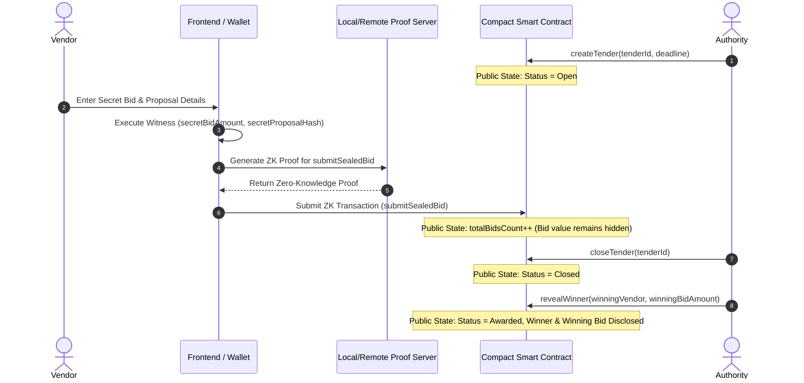

# Confidential Procurement & Tender Platform
## Level 3 Midnight Network Architectural Proposal & Technical Specification

---

## Executive Summary

The **Confidential Procurement & Tender Platform** is an enterprise-grade, privacy-preserving decentralized application (dApp) engineered on the **Midnight Network** using the **Compact Smart Contract Language**. The platform addresses a fundamental paradox in public and enterprise procurement: how to enforce transparent, fair, and auditable tender evaluation while guaranteeing absolute commercial confidentiality for submitted bids and technical proposals.

By combining Midnight’s dual-state ledger architecture (isolating public consensus state from private witness state) with client-side zero-knowledge (ZK) proof generation, the platform enables procurement authorities to host **Level 3 Sealed-Bid Auctions**. Vendors submit encrypted bids, hashed technical proposals, and private corporate credentials evaluated entirely within local ZK witness contexts. Financial amounts and technical secrets remain completely hidden from competitors, node operators, indexers, and public block explorers until the bidding window closes and selective winner disclosure is executed.

---

## Problem Statement

Commercial procurement processes across public sector agencies, defense contracting, enterprise supply chains, and municipal infrastructure represent trillions of dollars in annual expenditure. However, traditional electronic procurement platforms suffer from severe systemic vulnerabilities:

1. **Premature Financial & Strategy Leakage**: Inside actors or compromised database administrators can leak confidential bid prices prior to deadlines, enabling favored vendors to engage in bid shading, price sniping, or collusive bidding.
2. **Intellectual Property Exposure**: Proprietary technical proposals, architectural diagrams, and trade secrets submitted to centralized portals risk industrial espionage or data breaches.
3. **Lack of Cryptographic Auditability**: Traditional procurement portals rely on trust in centralized web servers and relational databases, offering no immutable, tamper-proof audit trails for bid submission timestamps or award fairness.
4. **Public Blockchain Transparency Pitfalls**: Standard public blockchains (e.g., Ethereum) expose all transactions, balances, and smart contract states by default. Deploying sealed-bid tenders on public ledgers without zero-knowledge privacy exposes sensitive corporate intelligence to competitors.

---

## Existing Procurement Challenges

| Challenge | Traditional Centralized Portal | Public Blockchain (Transparent) | Midnight Privacy-Preserving dApp |
| :--- | :--- | :--- | :--- |
| **Bid Price Confidentiality** | Vulnerable to insider leaks & database breaches | Completely public on ledger | **100% Private via ZK Witnesses** |
| **Technical Proposal Security** | Stored in central servers; vulnerable to IP theft | Exposed or easily linked off-chain | **Private Witness Hashing & Commitments** |
| **Vendor Eligibility Verification** | Requires sharing raw corporate credentials | Requires public credential broadcasting | **Zero-Knowledge Credential Proofs** |
| **Auditability & Non-Repudiation** | Relies on server logs (alterable) | Immutable ledger history | **Immutable Cryptographic Proofs** |
| **Winner Disclosure Control** | Opaque manual selection | Automatic or exposed prematurely | **Selective On-Chain Disclosures** |

---

## Proposed Solution

The platform delivers a zero-knowledge sealed-bid auction model where:
- **Tender Creation**: Procurement authorities define public tender parameters (ID, submission deadline, budget cap, required certifications) on the Midnight ledger.
- **Private Bid Witness Execution**: Vendors execute local zero-knowledge witness computations (`secretBidAmount()`, `secretProposalHash()`, `vendorEligibilitySecret()`) inside their local witness environment.
- **On-Chain Commitment**: The vendor's browser/client generates a zero-knowledge proof proving eligibility and bid compliance without revealing the bid amount or proposal content.
- **Sealed State Maintenance**: Bids remain cryptographically sealed on the ledger throughout the active bidding period.
- **Selective Winner Disclosure**: Once the submission deadline passes, the authority triggers the `revealWinner` circuit, disclosing only the winning vendor address and winning bid price while maintaining privacy for all losing bidders.

---

## Strategic Objectives

1. **Enforce Absolute Bid Confidentiality**: Guarantee that no party—including procurement authorities, competitors, or Midnight network validators—can inspect sealed bid values during the active tender lifecycle.
2. **Provide Verifiable Governance & Compliance**: Create an immutable on-chain record of tender state transitions (`Open`, `Closed`, `Awarded`) verified by Midnight network consensus.
3. **Deliver Full-Stack Level 3 dApp Integration**: Seamlessly connect a multi-circuit Compact smart contract (`contracts/procurement.compact`), a React 18 enterprise web interface, Midnight Lace Wallet integration, and local/remote ZK Proof Server infrastructure.
4. **Ensure Network Agnosticism**: Support deployment across Midnight Local Devnet, Midnight Testnet, and **Midnight Preprod**.

---

## Midnight Privacy Model

Midnight Protocol uses a dual-state architecture:
1. **Public State (Ledger)**: Synchronized across all network nodes, storing consensus state including active tender parameters, lifecycle statuses, registered vendor counts, and total bid counts.
2. **Private State (Witness Context)**: Stored locally on the user's client machine inside encrypted local level storage. Private witness functions evaluate sensitive inputs and generate zero-knowledge proofs.

```
       ┌───────────────────────────────────────────────────────────┐
       │                 PUBLIC LEDGER STATE                      │
       │  • Tender ID                    • Status (Open/Closed/...)│
       │  • Authority Address            • Registered Vendors Count│
       │  • Submission Deadline          • Total Bids Count        │
       └─────────────────────────────┬─────────────────────────────┘
                                     │
                 Public Transactions │ Verifiable ZK Proofs
                                     ▼
       ┌───────────────────────────────────────────────────────────┐
       │                PRIVATE WITNESS STATE                     │
       │  • secretBidAmount()            [Uint64]                 │
       │  • secretProposalHash()         [Bytes<32>]              │
       │  • vendorEligibilitySecret()   [Bytes<32>]              │
       └───────────────────────────────────────────────────────────┘
```

### Privacy Invariants

- **Zero-Knowledge Witness Isolation**: `secretBidAmount()` and `secretProposalHash()` are evaluated solely within the client's local ZK witness execution context.
- **Anonymity of Unsuccessful Bidders**: Losing bid amounts and proposal details are never published to the ledger.
- **Selective Disclosure**: Only the authority-triggered final settlement contract call (`revealWinner`) discloses the winner's metrics on-chain post-deadline.

---

## Zero-Knowledge Workflow



---

## Architecture & Technology Stack

The platform is structured into five modular, decoupled operational layers:

```
┌─────────────────────────────────────────────────────────────────────────┐
│                          1. REACT FRONTEND                              │
│         React 18 + TypeScript + Vite + Enterprise Light Styling         │
└────────────────────────────────────┬────────────────────────────────────┘
                                     │
                                     ▼
┌─────────────────────────────────────────────────────────────────────────┐
│                      2. MIDNIGHT WALLET ADAPTER                         │
│           Lace Wallet Integration & Account Abstraction Layer           │
└────────────────────────────────────┬────────────────────────────────────┘
                                     │
                                     ▼
┌─────────────────────────────────────────────────────────────────────────┐
│                    3. MIDNIGHT JS / PROOF PROVIDER                      │
│     @midnight-ntwrk/midnight-js-contracts & httpClientProofProvider     │
└────────────────────────────────────┬────────────────────────────────────┘
                                     │
              ┌──────────────────────┴──────────────────────┐
              ▼                                             ▼
┌───────────────────────────┐                 ┌───────────────────────────┐
│   4. PROOF SERVER (6300)  │                 │  5. MIDNIGHT NODE (RPC)   │
│   ZK Proof Generation     │                 │   Preprod RPC & Indexer   │
└───────────────────────────┘                 └───────────────────────────┘
```

### Technology Stack Specifications

- **Smart Contract Language**: Midnight Compact DSL (`v0.31.1` compiler / `v0.5.1` CLI)
- **Frontend Framework**: React 18, TypeScript 5, Vite 5, Lucide Icons
- **ZK Proving Engine**: Midnight Proof Server (Port `6300`)
- **Blockchain Infrastructure**: Midnight Preprod Testnet Node RPC & Indexer GraphQL API
- **Testing & Quality Assurance**: Vitest (`v2.1`), Automated CI/CD GitHub Actions
- **Hosting & Deployment**: Vercel Serverless Platform

---

## Repository Structure

```
confidential-procurement-tender-platform/
├── .github/
│   └── workflows/
│       └── ci.yml                 # GitHub Actions CI/CD pipeline
├── contracts/
│   ├── procurement.compact        # Compact smart contract circuits & state
│   └── managed/                   # Compiled ZK contract artifacts & keys
├── docs/
│   ├── landing-page.png           # Live Tender Marketplace screenshot
│   └── trade-page.png             # Vendor Sealed-Bid Hub screenshot
├── src/
│   ├── check-balance.ts           # Account balance verification utility
│   ├── cli.ts                     # Interactive terminal CLI application
│   ├── contract-client.ts         # Contract client & ledger decoders
│   ├── deploy.ts                  # Network deployment orchestrator
│   ├── network.ts                 # Multi-network configuration (Preprod/Devnet)
│   ├── setup.ts                   # Environment setup runner
│   └── wallet.ts                  # Midnight Wallet SDK context setup
├── tests/
│   ├── contract.test.ts           # Contract compilation unit tests
│   ├── network.test.ts            # Network resolution unit tests
│   └── privacy.test.ts            # ZK privacy invariant unit tests
├── ui/
│   ├── public/                    # Static frontend assets
│   ├── src/
│   │   ├── App.tsx                # Main React application & views
│   │   ├── index.css              # Enterprise Light Theme styling
│   │   └── main.tsx               # Entrypoint
│   ├── package.json               # UI frontend dependencies
│   └── vite.config.ts             # Vite build configuration
├── .env.example                   # Environment configuration template
├── docker-compose.yml             # Local Midnight devnet infrastructure
├── package.json                   # Root package dependencies & scripts
├── PROPOSAL.md                    # Level 3 Architecture & Proposal Document
└── README.md                      # Primary project documentation
```

---

## Security & Threat Model

1. **Replay & Front-Running Prevention**: Midnight transactions incorporate unique transaction nonces and commitment hashes, preventing adversaries from replaying submitted proofs.
2. **Local Witness Execution Isolation**: Private witness functions execute in isolated client environments. Private state storage is encrypted using user-configured passwords (`PRIVATE_STATE_PASSWORD`).
3. **Cryptographic Non-Repudiation**: Bids committed on-chain carry cryptographic witness signatures, preventing vendors from retracting or altering bids post-submission.
4. **Authority Access Control**: Critical circuit methods (`closeTender`, `revealWinner`) enforce public key authorization checks (`authorityAddress == caller`), preventing unauthorized state transitions.

---

## Expected Impact & Industry Applications

- **Public Sector & Government Contracting**: Ensures transparent compliance for municipal, state, and national infrastructure projects without exposing tender budgets or pricing models to competitors.
- **Enterprise Defense & Technology Procurement**: Enables high-security defense and aerospace contractors to bid on proprietary technical tasks without exposing intellectual property or technological specifications.
- **Commodities & Energy Supply Chains**: Facilitates private volume and price bidding for bulk energy, agricultural, and raw material contracts.

---

## Future Enhancements

1. **Multi-Criteria Scoring Engine**: Extend Compact circuits to support weighted multi-parameter scoring (e.g. 40% technical score, 60% price score) evaluated entirely inside ZK witnesses.
2. **Multi-Party Computation (MPC) Decryption**: Integrate threshold key decryption among an independent committee of procurement auditors.
3. **Decentralized Identity (DID) Integration**: Support W3C-compliant Verifiable Credentials (VCs) for automated vendor qualification checks.

---

## Conclusion

The **Confidential Procurement & Tender Platform** demonstrates the transformative power of Midnight Network's zero-knowledge privacy model. By converting traditional vulnerable procurement portals into a cryptographically secure, privacy-preserving dApp, the platform establishes a new benchmark for fair, auditable, and confidential enterprise commerce.
