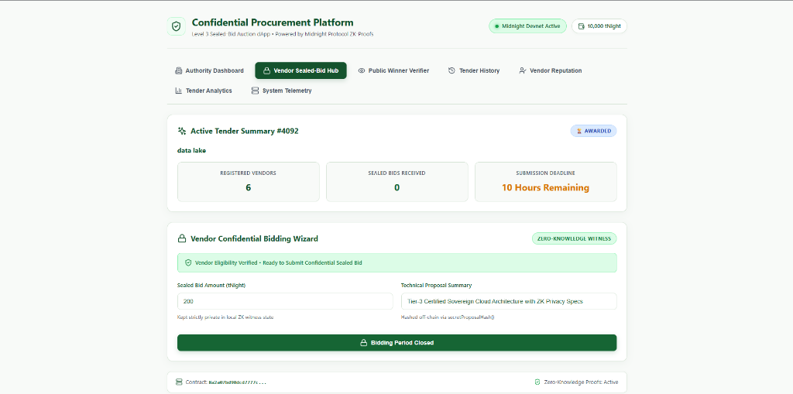

# Confidential Procurement & Tender Platform
### Level 3 Sealed-Bid Auction Architecture on Midnight Network

[](https://procurement-and-tender-rust.vercel.app/)
[](https://github.com/sayakkkk/procurement-and-tender)
[](https://github.com/sayakkkk/procurement-and-tender/actions)
[](https://youtu.be/QRd-vPrFKds)
[](https://midnight.network)
[](https://midnight.network)
[](https://nodejs.org)

An enterprise-grade, privacy-preserving decentralized procurement platform engineered on **Midnight Protocol** for official **Level 3 Sealed-Bid Auctions**. Procurement authorities publish public tender requirements while verified vendors submit zero-knowledge confidential sealed bids. Commercial bid amounts and technical proposals remain strictly private throughout the bidding window using local zero-knowledge witness execution environments.

---

## Live Demo, Video & Repository

- **Live Web Application**: [https://procurement-and-tender-rust.vercel.app/](https://procurement-and-tender-rust.vercel.app/)
- **GitHub Repository**: [https://github.com/sayakkkk/procurement-and-tender](https://github.com/sayakkkk/procurement-and-tender)
- **Official YouTube Demo Video**: [Watch Demo Video](https://youtu.be/QRd-vPrFKds)
- **CI/CD Pipeline Status**: [View GitHub Actions Runs](https://github.com/sayakkkk/procurement-and-tender/actions)

---

## Screenshots

### 1. Landing Page & Tender Marketplace

*The Live Tender Marketplace & Authority Dashboard showing active procurement opportunities, live deadline countdown timers, registered vendor counters, total sealed bid counts, and the interactive 'Bid Now' workflow navigation.*

### 2. Vendor Sealed-Bid Portal

*Vendor Portal enabling eligibility verification token creation, client-side SHA-256 bid commitment calculation with secret nonces, and encrypted local bid vault persistence.*

### 3. Public Zero-Knowledge Outcome Verification

*Cryptographic proof verification suite allowing public verifiers to validate that the revealed winning bid corresponds to the on-chain commitment without exposing losing bids.*

---

## Midnight Privacy & State Model

The platform leverages Midnight's dual-state architecture, strictly separating public on-chain consensus state from private client-side zero-knowledge witness state.

### Ledger / Public Consensus State
- **Tender Registry**: Multi-tender map indexed by unique 64-bit `tenderId`, storing authority address, deadline timestamp, status (`Open`, `Closed`, `Awarded`), winning vendor address, and winning bid amount.
- **Vendor Registration**: Scoped commitments indexing eligible vendors for specific tender IDs.
- **Bid Commitments**: Cryptographic SHA-256 / Pedersen commitments binding `(tenderId, vendorAddress, bidAmount, secretNonce)` to on-chain state without exposing raw amounts.

### Private Client-Side Witness State
- **Bid Amount**: Raw numerical offer known only to the bidding vendor before official reveal.
- **Blinding Nonce**: 256-bit cryptographically secure random secret preventing rainbow table / brute-force attacks against commitments.
- **Eligibility Secret**: Private credential token proving vendor authorization without leaking corporate identity.

### Privacy Guarantees
1. **Bid Secrecy**: No validator, node operator, indexer, or competitor can determine the bid amount while a tender is open.
2. **Preimage Binding**: A winner reveal cannot alter the winning bid amount or vendor address after bidding closes without invalidating the cryptographic commitment check.
3. **Losing Bid Confidentiality**: Only the winning offer is disclosed upon award; losing bids remain mathematically sealed in perpetuity.
4. **Multi-Tender Isolation**: All tenders operate independently with isolated vendor lists, commitments, and deadlines.

---

## Compact Contract Circuits

Target contract: `contracts/procurement.compact`  
Generated artifacts: `contracts/managed/procurement/`

| Circuit | Role | Public Inputs / State Changes | Private Witnesses | Security / Invariant Guarantee |
| :--- | :--- | :--- | :--- | :--- |
| `createTender` | Authority | `tenderId`, `deadline`, `authority` -> `tenders` | None | Rejects duplicate tender IDs; enforces positive duration. |
| `registerVendor` | Vendor | `tenderId`, `vendorPubKey` -> `registeredVendors` | `eligibilitySecret` | Verifies non-empty credential; prevents duplicate registrations. |
| `submitSealedBid` | Vendor | `tenderId`, `commitment` -> `bidCommitments` | `bidAmount`, `nonce` | Enforces deadline and registration; prevents duplicate bids; binds commitment. |
| `closeTender` | Authority | `tenderId` -> status `Closed` | None | Enforces authority authorization and deadline expiration. |
| `revealWinner` | Authority / Winner | `tenderId`, `winner`, `bid`, `commitment` -> status `Awarded` | `bidAmount`, `nonce` | Proves mathematical correspondence to on-chain commitment; binds winner identity. |

---

## Automated Test Suites

The test suite executes genuine Compact smart contract circuits and cryptographic invariants across 4 dedicated test files (21 passing tests):

```bash
npm test
```

### Test Coverage Breakdown:
1. **`tests/contract.test.ts` (3 tests)**:
   - Validates generated Compact ZK proving keys, verifier keys, and ZKIR bytecode.
   - Executes full 5-stage procurement lifecycle in-memory via Compact runtime (`createTender` -> `registerVendor` -> `submitSealedBid` -> `closeTender` -> `revealWinner`).
   - Verifies cross-tender state isolation between concurrent tenders.

2. **`tests/privacy.test.ts` (4 tests)**:
   - Verifies bid amounts and nonces remain private witnesses in circuit execution.
   - Enforces cryptographic commitment binding to prevent winner tampering.
   - Validates that tampered bid amounts or nonces are rejected.
   - Proves vendor eligibility credentials are cryptographically validated.

3. **`tests/invariants.test.ts` (10 tests)**:
   - Rejection of duplicate tender creation.
   - Rejection of vendor registration on non-existent tenders.
   - Rejection of duplicate vendor registration on the same tender.
   - Rejection of bid submissions from unregistered vendors.
   - Rejection of duplicate bid submissions from the same vendor.
   - Rejection of bid submissions after deadline expiration.
   - Rejection of zero or invalid bid amounts.
   - Rejection of closing an open tender before deadline expiration.
   - Rejection of revealing a winner while bidding is still open.
   - Rejection of declaring a non-participant as the winning vendor.

4. **`tests/network.test.ts` (4 tests)**:
   - Resolves network configuration flags (`preprod`, `undeployed`).
   - Validates 64-character hex seed format.
   - Verifies local ZK Proof Server health endpoint (`http://127.0.0.1:6300/health`).

---

## Local Setup & Quickstart

### Prerequisites
- Node.js `v22.23.1+`
- npm `10.9.8+`
- Docker & Docker Compose (for local proof server)
- Midnight Compact Compiler `v0.31.1+` (optional if using managed artifacts)
- Midnight Lace Wallet Chrome Extension

### 1. Installation
```bash
git clone https://github.com/sayakkkk/procurement-and-tender.git
cd procurement-and-tender
npm install
```

### 2. Start ZK Proof Server
```bash
npm run proof-server:start
# Confirms healthy on http://127.0.0.1:6300/health
```

### 3. Run Test Suite
```bash
npm test
```

### 4. Build & Launch Web UI
```bash
npm run dev:ui
# Opens http://localhost:5173
```

---

## Midnight Preprod Configuration

- **Target Network**: Midnight Preprod Testnet
- **Network ID**: `preprod` (ID: 1)
- **Indexer GraphQL Endpoint**: `https://indexer.preprod.midnight.network/api/v4/graphql`
- **Proof Server Endpoint**: `http://127.0.0.1:6300` (Local)
- **Deployed Procurement Contract Address**: `02008ff27a073d6c82d166cee06f1571d8f9b4e7b4a4e9f310367a7c719b52da30b9`

---

## License
MIT License. Engineered for the Midnight Network Community.
