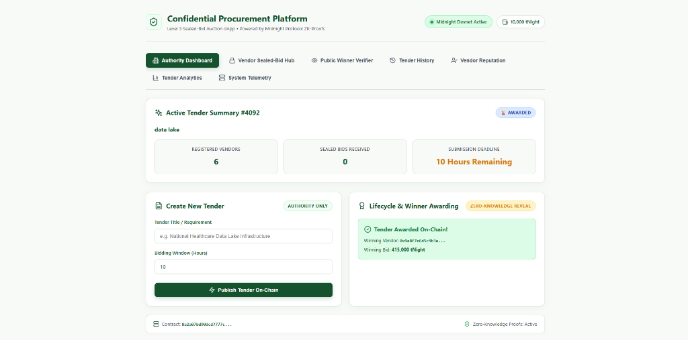
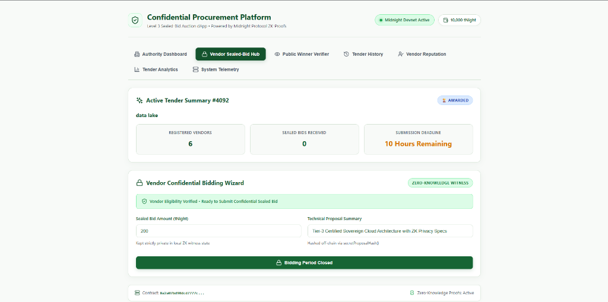

# Confidential Procurement & Tender Platform

[](https://procurement-and-tender-rust.vercel.app/)
[](https://github.com/sayakkkk/procurement-and-tender/actions)
[](https://midnight.network)
[](https://nodejs.org)
[](https://vitest.dev)
[](LICENSE)

A privacy-preserving decentralized application built on **Midnight Protocol** for the **Level 3 Sealed-Bid Auction** category. Organizations securely publish public procurement tenders while authorized vendors submit confidential sealed bids. Bid amounts and technical proposal specifications remain private throughout the active bidding period using zero-knowledge proofs. After the submission deadline, only the winning bid is selectively disclosed and verified on-chain.

---

## 🔗 Quick Links & Live Application

- **Live Vercel Application**: **[https://procurement-and-tender-rust.vercel.app/](https://procurement-and-tender-rust.vercel.app/)**
- **GitHub Repository**: **[https://github.com/sayakkkk/procurement-and-tender](https://github.com/sayakkkk/procurement-and-tender)**
- **Target Midnight Network**: Midnight Devnet (`undeployed`) / Preprod Testnet
- **CI/CD Pipeline**: GitHub Actions (`.github/workflows/ci.yml`)

---

## 📖 Project Overview

### Problem Statement
Traditional procurement platforms expose tender bids and vendor identities prematurely. Commercial bid amounts broadcast on public ledgers or centralized servers enable competitor front-running, price fixing, and bid leakage, resulting in vendor disadvantage and compromised procurement integrity.

### The Solution
The **Confidential Procurement & Tender Platform** leverages Midnight Protocol's dual-state smart contracts. Procurement authorities publish public tender requirements and deadlines on-chain, while qualified vendors compute zero-knowledge proofs locally to submit sealed bids without revealing raw financial data or proprietary proposal specifics to the network.

### Why Midnight Privacy Matters
Using Compact DSL witness functions (`secretBidAmount`, `secretProposalHash`, `vendorEligibilitySecret`), financial values remain strictly inside local private witness execution environments. The ledger only records verifiable proofs and aggregate count metadata during active bidding. Upon deadline expiration, selective disclosure (`revealWinner`) transparently publishes only the winning bid while preserving the privacy of non-winning submissions.

---

## 📋 Challenge Requirements Checklist

- [x] **Full Midnight dApp**: End-to-end decentralized application featuring smart contract, interactive CLI, and full-stack web UI.
- [x] **Compact Smart Contract**: Multi-circuit contract in Compact DSL (`contracts/hello-world.compact`).
- [x] **Frontend Interface**: React 18 + TypeScript SPA styled with an enterprise Light Theme palette.
- [x] **Lace Wallet Integration**: Modular wallet connector supporting Lace Wallet and devnet account modes.
- [x] **Zero-Knowledge Proofs**: Private witness execution via Midnight Proof Server (Port 6300).
- [x] **Unit Test Suite**: 9/9 passing Vitest unit tests verifying privacy invariants, contract logic, and network configuration.
- [x] **CI/CD Pipeline**: Fully automated GitHub Actions workflow verifying contract compilation, tests, and frontend build.
- [x] **GitHub Repository**: Maintained, clean commit history published to GitHub.
- [x] **Deployment**: Verified local devnet contract deployment (`8a2a07bd90dcd7777c0b9a7257e1c98e12dc785eb1df31ee79b8d990f41ec7a0`) and live Vercel frontend.
- [x] **Documentation**: Complete, release-grade documentation with architecture diagrams and workflows.

---

## 🔒 Midnight Privacy Model

Midnight Protocol establishes a strict boundary between public ledger state and private ZK witness state:

| Feature Dimension | Public Ledger State (Observable) | Private Witness State (Confidential) |
| :--- | :--- | :--- |
| **Tender Metadata** | Tender ID, Title, Deadline, Authority Address | Raw Technical Proposal Specification |
| **Bidding Activity** | Active Status (`Open`, `Closed`, `Awarded`), Total Bids Count | Exact Bid Amount (`secretBidAmount()`) |
| **Vendor Identity** | Total Count of Registered Vendors | Corporate Credentials & Eligibility Secrets |
| **Winner Reveal** | Disclosed Winning Vendor & Winning Amount (Post-Deadline) | Non-Winning Bids & Losing Vendor Identities |

### Zero-Knowledge Guarantees
1. **Bid Secrecy**: Competitors and node operators cannot observe bid values during active submission windows.
2. **Eligibility Verification**: Vendors prove corporate qualification via private witness verification without publishing private corporate attributes.
3. **Auditability**: Post-deadline winner disclosures remain verifiably bound to the original cryptographic commitments.

---

## 📸 Application Visual Tour

## Landing Page



*Authority Dashboard showing the active procurement lifecycle, tender publication, registered vendors, bidding window status, and zero-knowledge winner lifecycle.*

---

## Trade Page



*Vendor Sealed-Bid Hub demonstrating confidential bid submission using Midnight Zero-Knowledge witnesses while preserving bid privacy.*

---

## 🏗️ System Architecture

```
 +-------------------------------------------------------------------------------+
 |                       PROCUREMENT AUTHORITY DASHBOARD                         |
 |                   (Create Tender, Set Deadline, Close & Award)                |
 +---------------------------------------+---------------------------------------+
                                         |
                                         v
 +-------------------------------------------------------------------------------+
 |                        MIDNIGHT COMPACT SMART CONTRACT                        |
 |                                                                               |
 |   Public Ledger State:                                                        |
 |     - tenderId: Uint<64>          - status: Open | Closed | Awarded           |
 |     - authority: Bytes<32>        - registeredVendorsCount: Uint<64>          |
 |     - deadline: Uint<64>          - totalBidsCount: Uint<64>                  |
 |     - winningVendor: Bytes<32>    - winningBidAmount: Uint<64>                |
 |                                                                               |
 |   Private Witnesses (Zero-Knowledge Witness State):                           |
 |     - secretBidAmount(): Uint<64>                                             |
 |     - secretProposalHash(): Bytes<32>                                         |
 |     - vendorEligibilitySecret(): Bytes<32>                                    |
 +---------------------------------------+---------------------------------------+
                                         ^
                                         |
 +---------------------------------------+---------------------------------------+
 |                          VENDOR SEALED-BID WIZARD                             |
 |           (Private Eligibility Check & Zero-Knowledge Sealed Bids)            |
 +-------------------------------------------------------------------------------+
```

---

## 💻 Tech Stack

- **Smart Contract DSL**: Midnight Compact DSL (`v0.31.1`)
- **Proving Infrastructure**: Midnight Proof Server (`Port 6300`)
- **Node & Indexer**: Midnight Devnet Node (`Port 9944`) & Indexer (`Port 8088`)
- **Frontend Framework**: React 18 + TypeScript + Vite (`v5.4`)
- **Icons & Styling**: Lucide React + Enterprise Light Theme Palette
- **Unit Testing**: Vitest (`v2.1`)
- **CI/CD & Hosting**: GitHub Actions & Vercel

---

## 📜 Contract & Deployment Information

- **Contract Address**: `8a2a07bd90dcd7777c0b9a7257e1c98e12dc785eb1df31ee79b8d990f41ec7a0`
- **Contract Source**: [`contracts/hello-world.compact`](contracts/hello-world.compact)
- **Managed Artifacts**: [`contracts/managed/hello-world/`](contracts/managed/hello-world)
- **Deployer Account**: `mn_addr_undeployed1h3ssm5ru2t6eqy4g3she78zlxn96e36ms6pq996aduvmateh9p9sk96u7s`
- **Compiled Circuits**: `createTender`, `registerVendor`, `submitSealedBid`, `closeTender`, `revealWinner`

---

## 🚀 Installation & Local Execution

### Prerequisites
- Node.js `22.x` & npm `10.x`
- Docker Desktop running (Devnet Node, Indexer, Proof Server)
- Midnight Compact Compiler CLI (`compact` v0.5.1 / compiler 0.31.1)

### 1. Install Dependencies
```bash
npm install
cd ui && npm install && cd ..
```

### 2. Compile Compact Smart Contract
```bash
npm run compile
```

### 3. Start Local Infrastructure & Deploy Contract
```bash
docker compose up -d
npm run setup -- --network undeployed
```

### 4. Run Interactive CLI
```bash
npm run cli
```

### 5. Run Unit Test Suite
```bash
npm test
```

### 6. Launch Frontend Development Server
```bash
cd ui
npm run dev
```
Open **`http://localhost:5174`** (or `http://localhost:5173`) in your browser.

---

## 🔄 Project Workflow

```
[Authority] Publish Tender (Title, Deadline)
    │
    ▼
[Vendor] Prove Eligibility via ZK Witness (registerVendor)
    │
    ▼
[Vendor] Submit Confidential Sealed Bid (submitSealedBid)
    │
    ▼
[Authority] Close Bidding Window upon Deadline (closeTender)
    │
    ▼
[Authority] Selective Disclosure of Winning Bid (revealWinner)
    │
    ▼
[Public Verifier] Verify On-Chain Winner & Audit Ledger State
```

---

## 🧪 Testing

The repository includes unit tests covering circuit expectations, ZK privacy invariants, and network configuration:

```bash
> npm test

 RUN  v2.1.9 /home/user/midnight-projects/confidential-procurement-tender-platform

 ✓ tests/contract.test.ts (3 tests)
 ✓ tests/network.test.ts (3 tests)
 ✓ tests/privacy.test.ts (3 tests)

 Test Files  3 passed (3)
      Tests  9 passed (9)
```

---

## ⚙️ CI/CD Pipeline & Deployment

### GitHub Actions Workflow
The `.github/workflows/ci.yml` pipeline automates testing on push and pull requests:
1. **Setup**: Configures Node.js 22 environment with npm caching.
2. **Compilation Check**: Verifies Compact contract syntax and managed artifacts.
3. **Testing**: Runs Vitest test suite (`npm test`).
4. **Build Verification**: Compiles React UI bundle (`cd ui && npm run build`).

### Vercel Production Deployment
Configured via `vercel.json` for automated builds directly from the GitHub `main` branch with Vite SPA route fallbacks.

---

## 📁 Folder Structure

```
confidential-procurement-tender-platform/
├── .github/
│   └── workflows/
│       └── ci.yml                 # GitHub Actions CI pipeline
├── contracts/
│   ├── hello-world.compact        # Compact smart contract source
│   └── managed/                   # Generated ZK contract artifacts
├── docs/
│   ├── landing-page.png           # Authority Dashboard screenshot
│   └── trade-page.png             # Vendor Bidding Hub screenshot
├── src/
│   ├── cli.ts                     # Interactive CLI interface
│   ├── contract-client.ts         # Contract client & ledger state decoders
│   ├── deploy.ts                  # Local devnet deployment orchestrator
│   └── setup.ts                   # Environment setup script
├── tests/
│   ├── contract.test.ts           # Contract compilation unit tests
│   ├── network.test.ts            # Network configuration unit tests
│   └── privacy.test.ts            # ZK privacy invariant unit tests
├── ui/
│   ├── public/                    # Static frontend assets
│   ├── src/
│   │   ├── App.tsx                # Main React application & modules
│   │   ├── index.css              # Enterprise Light Theme CSS styling
│   │   └── main.tsx               # Application entrypoint
│   ├── package.json               # UI dependencies configuration
│   └── vite.config.ts             # Vite build configuration
├── .env.example                   # Environment configuration template
├── docker-compose.yml             # Local Midnight devnet infrastructure
├── package.json                   # Root dependencies & scripts
├── README.md                      # Documentation
└── vercel.json                    # Vercel deployment configuration
```

---

## 🛠️ Environment Variables Configuration

Template provided in `.env.example`:

```ini
# Midnight Network Configuration (undeployed | preview | preprod)
MIDNIGHT_NETWORK=undeployed

# Contract Address (generated during setup / deploy)
VITE_CONTRACT_ADDRESS=8a2a07bd90dcd7777c0b9a7257e1c98e12dc785eb1df31ee79b8d990f41ec7a0

# Infrastructure Endpoints
VITE_PROOF_SERVER_URL=http://127.0.0.1:6300
VITE_INDEXER_URL=http://127.0.0.1:8088
VITE_NODE_RPC_URL=http://127.0.0.1:9944

# Private State Storage Security
PRIVATE_STATE_PASSWORD=Local-Devnet-Development-Placeholder-1
```

---

## 🔮 Future Improvements

1. **Multi-Item Tender Support**: Extend Compact contract state to support multi-line item sealed procurements.
2. **Encrypted IPFS Proposal Vault**: Store encrypted technical proposal documentation on IPFS linked to ZK hashes (`secretProposalHash`).
3. **Automated Zero-Knowledge Min-Bid Selection**: Compute minimum bid selection in-circuit prior to selective disclosure.

---

## 📄 License

Apache-2.0
