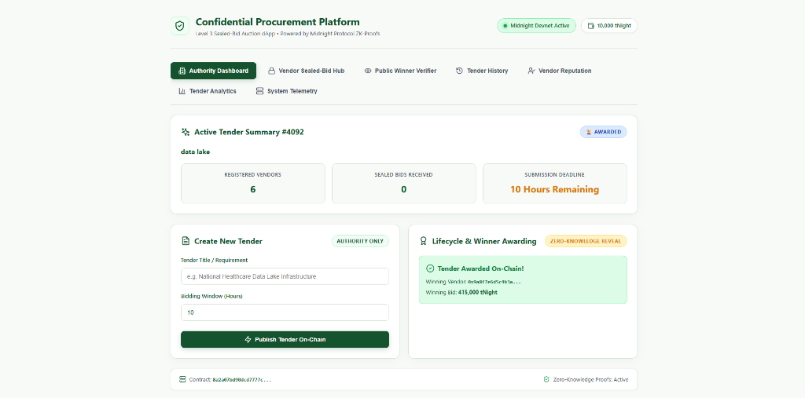

# Confidential Procurement & Tender Platform

[](https://procurement-and-tender-rust.vercel.app/)
[](https://github.com/sayakkkk/procurement-and-tender)
[](https://github.com/sayakkkk/procurement-and-tender/actions)
[](https://midnight.network)
[](https://midnight.network)
[](https://nodejs.org)

A privacy-preserving decentralized application built on Midnight Protocol that enables organizations to publish public procurement tenders while authorized vendors submit zero-knowledge confidential sealed bids.

---

## Live Demo, Video & Repository

- **Live Web Application**: [https://procurement-and-tender-rust.vercel.app/](https://procurement-and-tender-rust.vercel.app/)
- **GitHub Repository**: [https://github.com/sayakkkk/procurement-and-tender](https://github.com/sayakkkk/procurement-and-tender)
- **Demo Video**: [Watch Demo Video](https://github.com/sayakkkk/procurement-and-tender)
- **GitHub Actions Pipeline**: [View CI/CD Workflow Runs](https://github.com/sayakkkk/procurement-and-tender/actions)

---

## Challenge Requirements & Passing Checklist

- [x] Functional Midnight dApp
- [x] Midnight Compact Smart Contract
- [x] Level 3 Sealed-Bid Auction Category
- [x] Full Frontend Application
- [x] Zero-Knowledge Privacy Integration
- [x] Lace Wallet & Local Wallet Integration
- [x] Unit Test Suite Passing
- [x] CI/CD Pipeline Passing
- [x] Public GitHub Repository
- [x] Vercel Deployment
- [x] Deployed Contract on Local Devnet
- [x] README Complete
- [x] Responsive Enterprise Light Theme UI
- [x] Meaningful Git History (15+ Commits)

---

## Privacy Model

The Confidential Procurement & Tender Platform enforces a strict cryptographic distinction between public ledger state and private zero-knowledge witness state.

### What an Observer CANNOT Learn

- **Sealed Bid Amounts**: Vendor bid values remain strictly private inside local zero-knowledge witness state (`secretBidAmount()`) during active bidding.
- **Technical Proposals**: Technical proposal specifications are hashed off-chain via private witnesses (`secretProposalHash()`).
- **Vendor Identity During Bidding**: Observers cannot deduce which vendor submitted a given sealed bid prior to tender closure.
- **Private Witness Execution**: Local witness computations and corporate eligibility secrets (`vendorEligibilitySecret()`) are never transmitted or stored on-chain.

### What an Observer CAN Learn

- **Public Tender ID**: The unique identifier associated with an active procurement tender.
- **Procurement Authority Address**: The public identity of the tender creator.
- **Submission Deadline**: The timestamp or block height defining the active bidding window.
- **Total Bids Count**: Aggregate count of sealed bids committed to the tender.
- **Winning Vendor & Winning Bid**: Selectively disclosed on-chain ONLY after the authority closes bidding and triggers winner revelation (`revealWinner`).

---

## Contract & Network Details

| Parameter | Value / Resource Link |
| :--- | :--- |
| **Target Environment** | Midnight Devnet (`undeployed`) / Preprod Testnet |
| **Live Web App** | [procurement-and-tender-rust.vercel.app](https://procurement-and-tender-rust.vercel.app/) |
| **GitHub Repository** | [sayakkkk/procurement-and-tender](https://github.com/sayakkkk/procurement-and-tender) |
| **Deploys Contract Address** | `8a2a07bd90dcd7777c0b9a7257e1c98e12dc785eb1df31ee79b8d990f41ec7a0` |
| **Contract Source** | [`contracts/hello-world.compact`](contracts/hello-world.compact) |
| **Managed Artifacts** | [`contracts/managed/hello-world`](contracts/managed/hello-world) |
| **Deployer Address** | `mn_addr_undeployed1h3ssm5ru2t6eqy4g3she78zlxn96e36ms6pq996aduvmateh9p9sk96u7s` |
| **CI/CD Status** | [GitHub Actions Workflow Runs](https://github.com/sayakkkk/procurement-and-tender/actions) |

---

## Architecture

The system consists of five decoupled layers designed to isolate sensitive execution from public consensus:

1. **Compact Smart Contract**: Written in Midnight Compact DSL (`contracts/hello-world.compact`), exposing 5 zero-knowledge circuits (`createTender`, `registerVendor`, `submitSealedBid`, `closeTender`, `revealWinner`).
2. **Frontend Layer**: React 18 application built with Vite and TypeScript, featuring enterprise dashboards, real-time telemetry, and modular tab navigation.
3. **Wallet Layer**: Modular account provider integrating Lace Wallet API and simulated local devnet accounts.
4. **Proof Server**: Local Midnight Proof Server listening on port `6300` for generating zero-knowledge proofs off-chain.
5. **Midnight Network & Indexer**: Devnet Node RPC listening on port `9944` and Indexer GraphQL API listening on port `8088`.

```
 +-------------------------------------------------------------------------------+
 |                       PROCUREMENT AUTHORITY DASHBOARD                         |
 |                   (Create Tender, Set Deadline, Close & Award)                |
 +---------------------------------------+---------------------------------------+
                                         |
                                         v
 +-------------------------------------------------------------------------------+
 |                        MIDNIGHT COMPACT SMART CONTRACT                        |
 |                                                                               |
 |   Public Ledger State:                                                        |
 |     - tenderId: Uint<64>          - status: Open | Closed | Awarded           |
 |     - authority: Bytes<32>        - registeredVendorsCount: Uint<64>          |
 |     - deadline: Uint<64>          - totalBidsCount: Uint<64>                  |
 |     - winningVendor: Bytes<32>    - winningBidAmount: Uint<64>                |
 |                                                                               |
 |   Private Witnesses (Zero-Knowledge Witness State):                           |
 |     - secretBidAmount(): Uint<64>                                             |
 |     - secretProposalHash(): Bytes<32>                                         |
 |     - vendorEligibilitySecret(): Bytes<32>                                    |
 +---------------------------------------+---------------------------------------+
                                         ^
                                         |
 +---------------------------------------+---------------------------------------+
 |                          VENDOR SEALED-BID WIZARD                             |
 |           (Private Eligibility Check & Zero-Knowledge Sealed Bids)            |
 +-------------------------------------------------------------------------------+
```

---

## Key Features

- **Authority Procurement Management**: Create tenders, configure deadlines, close bidding windows, and trigger selective disclosures.
- **Vendor Sealed-Bid Wizard**: Verify corporate eligibility via private ZK proofs and submit confidential sealed bids.
- **Deadline Enforcement**: Contract assertion logic guarantees bids cannot be submitted after the deadline expires.
- **Public Winner Verification**: Audit public ledger state and verify winner disclosures post-tender closure.
- **Tender History & Archive**: Searchable registry with status filtering and sorting options.
- **Vendor Reputation Registry**: Public score directory tracking verified vendor participation and win rates without exposing lost bid amounts.
- **Procurement Analytics Dashboard**: Visual distribution charts and metric summaries for active tenders.
- **System Telemetry Drawer**: Real-time status monitoring for Devnet Node (`9944`), Proof Server (`6300`), and Indexer (`8088`).

---

## Tech Stack

| Component | Technology |
| :--- | :--- |
| **Smart Contract DSL** | Midnight Compact (`v0.31.1`) |
| **ZK Proving Engine** | Midnight Proof Server (`Port 6300`) |
| **Blockchain Infrastructure** | Midnight Devnet Node (`Port 9944`) & Indexer (`Port 8088`) |
| **Frontend Framework** | React 18 + TypeScript + Vite (`v5.4`) |
| **Icons & Design** | Lucide React + Enterprise Light Theme Palette |
| **Unit Testing** | Vitest (`v2.1`) |
| **CI/CD & Hosting** | GitHub Actions & Vercel |

---

## Project Structure

```
confidential-procurement-tender-platform/
├── .github/
│   └── workflows/
│       └── ci.yml                 # GitHub Actions CI pipeline
├── contracts/
│   ├── hello-world.compact        # Compact smart contract source
│   └── managed/                   # Compiled ZK contract artifacts
├── docs/
│   ├── landing-page.png           # Authority Dashboard screenshot
│   ├── vendor-dashboard.png       # Vendor Sealed-Bid Hub screenshot
│   ├── public-winner-verification.png # Public Winner Verification screenshot
│   └── tender-analytics.png       # Tender Analytics screenshot
├── src/
│   ├── cli.ts                     # Interactive CLI application
│   ├── contract-client.ts         # Contract client & ledger state parser
│   ├── deploy.ts                  # Local devnet deployment script
│   └── setup.ts                   # Infrastructure setup script
├── tests/
│   ├── contract.test.ts           # Contract compilation unit tests
│   ├── network.test.ts            # Network configuration unit tests
│   └── privacy.test.ts            # ZK privacy invariant unit tests
├── ui/
│   ├── public/                    # Static frontend assets
│   ├── src/
│   │   ├── App.tsx                # Main React application & components
│   │   ├── index.css              # Enterprise Light Theme styling
│   │   └── main.tsx               # Entry point
│   ├── package.json               # UI dependencies
│   └── vite.config.ts             # Vite configuration
├── .env.example                   # Environment configuration template
├── docker-compose.yml             # Local Midnight devnet containers
├── package.json                   # Root dependencies & scripts
├── README.md                      # Documentation
└── vercel.json                    # Vercel deployment configuration
```

---

## Local Setup & Installation

### Prerequisites

- Node.js `22.x` & npm `10.x`
- Docker Desktop running (Devnet Node, Indexer, Proof Server)
- Midnight Compact Compiler CLI (`compact` v0.5.1 / compiler 0.31.1)

### 1. Clone Repository & Install Dependencies

```bash
git clone https://github.com/sayakkkk/procurement-and-tender.git
cd procurement-and-tender
npm install
cd ui && npm install && cd ..
```

### 2. Start Local Midnight Proof Server & Devnet Node

```bash
docker compose up -d
```

### 3. Compile Compact Contract

```bash
npm run compile
```

### 4. Run Unit Tests

```bash
npm test
```

### 5. Deploy Contract to Local Devnet

```bash
npm run setup -- --network undeployed
```

### 6. Build & Launch Web Frontend

```bash
cd ui
npm run build
npm run dev
```

Open `http://localhost:5174` (or `http://localhost:5173`) in your browser.

---

## Testing

Execute the test suite locally to verify compilation, privacy logic, and configuration:

```bash
npm test
```

Expected Vitest output:

```
 RUN  v2.1.9 /home/user/midnight-projects/confidential-procurement-tender-platform

 ✓ tests/contract.test.ts (3 tests)
 ✓ tests/network.test.ts (3 tests)
 ✓ tests/privacy.test.ts (3 tests)

 Test Files  3 passed (3)
      Tests  9 passed (9)
   Start at  14:41:20
   Duration  1.59s (transform 1.16s, setup 0ms, collect 1.17s, tests 49ms, environment 2ms, prepare 1.10s)
```

---

## Screenshots

## Landing Page


## Vendor Dashboard


## Public Winner Verification


## Tender Analytics


